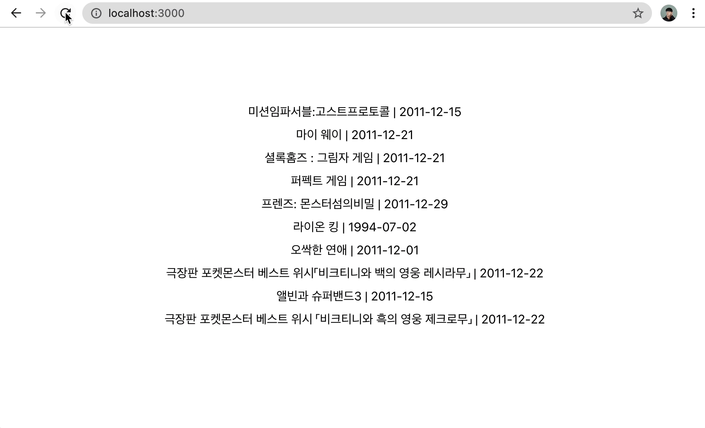

# kobis-api
- 영화진흥위원회(kobis)의 API를 활용하여 간단하게 영화 목록을 보여주는 기능입니다.



<br>

## Setting
- 아래 사전 준비가 필요합니다.   
- 해당 레포지토리에 위치한 터미널에서 아래 명령어를 입력해주세요.
```
npm install
npm start
```
- 루트 디렉토리에 `.env` 파일을 만들어 아래와 같이 적용해주세요.
  (API Key 발급은 [영화진흥위원회 오픈API 사이트](https://kobis.or.kr/kobisopenapi/homepg/board/findTutorial.do?targetId=section_3)를 이용해주세요)
```
REACT_APP_API_KEY=<Your API Key>
```
